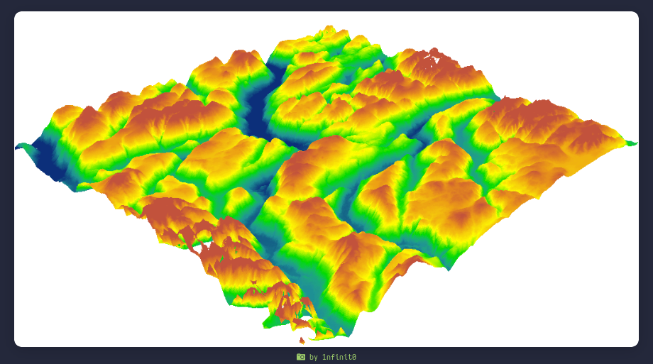

# Unreal Engine y su uso en la industria geocientífica

## ¿Qué es Unreal Engine?

Unreal Engine es un motor de videojuegos desarrollado por Epic Games. Es utilizado en la industria de los videojuegos, la arquitectura, la cinematografía y la industria geocientífica. Sin embargo, existe un nicho en el que Unreal Engine ha demostrado ser una herramienta poderosa: la visualización de datos geográficos.

## ¿Cómo se utiliza Unreal Engine en investgación?

### Fotogrametría

La fotogrametría es una técnica que permite obtener información precisa sobre la forma y las dimensiones de objetos a partir de fotografías. En la industria geocientífica, la fotogrametría se utiliza para crear modelos 3D de terrenos y estructuras geológicas. Unreal Engine permite importar estos modelos y visualizarlos en tiempo real, lo que facilita la interpretación de los datos.

### Simulación de procesos geológicos

Unreal Engine también se utiliza para simular procesos geológicos, como la formación de montañas, la erosión de terrenos y la actividad volcánica. Estas simulaciones permiten a los geocientíficos comprender mejor los procesos naturales y predecir posibles eventos geológicos.

### Modelos de elavación y mapas topográficos

Unreal Engine es capaz de importar modelos de elevación y mapas topográficos para crear entornos virtuales realistas. Estos entornos pueden ser utilizados para la planificación de proyectos geocientíficos, la visualización de datos y la formación de profesionales.

Unreal Engine admite la importación de mapas de elevación en formatos como GeoTIFF o ASCII DEM a través de herramientas de terceros como World Machine, Gaea, o el propio Landscape Editor de UE.

## Ejemplos

## Integrantes

Ariana Valentina Sotillo Martinez - U24214194

victor Antonio ramos Valverde

Huatay Salcedo, Luis Elías U24218809
